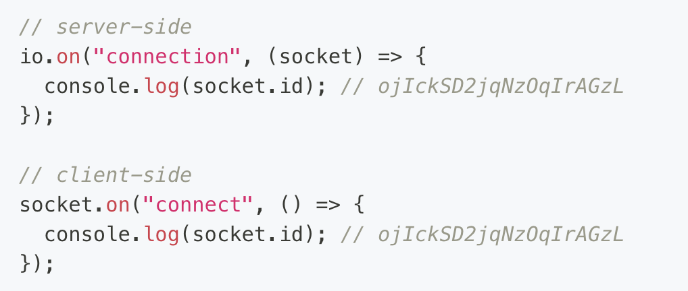

Welcome!!

npm run dev: runs localhost server and client 

figma wireframe: 
https://www.figma.com/file/qWlffP9CnZ5wAi8yN26HmB/chatroom-%2F-meetup-app?type=design&node-id=0%3A1&mode=design&t=KjADbWkktBy93sBe-1

Learnings and Research
 
 Socket Io 
 - socket.io => client => server
 - websockets opens a line of communication and leaves it open while its active
 - typically the sockets take an action (socket.on/socket.io/socket.emit), pass a function and then chooses to respond back with something
 - To use ONE json file with all dependencies installed, you must create custom scripts to run the client, server and tailwind ion parallel 
 - Auto-save MUST be turned off for the only one client to be loaded
 - client uses connect, server uses connection
 - you can make a custom action which triggers when the browser interaction happens and then lines up with the back end socket.io connection
 - socket.id is NOT to be used as an ID
 - every time the server is re-started, the session will end

 questions: 
 - how to make the messages persist even after the browser is refreshed
    - having an ID / creating an account
    - Using an external database
    - 
 - How do namespaces work and what are they? 
 - How does Deployment work using something like AWS and docker?
 - Do I want lazy loading? what is the point of lazy loading?

 listeners: 
 - Client: 'connect'
 - Server: 'connection' 
 - 'disconnect' ->  socket.io action
 - socket.on('send message', (kōrero: string) => {io.emit('new message', kōrero)}) -> passes a function as a parameter and within the function emits when new message is triggered and the variable packet of kōrero is passed 

SOCKETS CHEAT SHEET: 
- io.to(socket.id).emit('')
- io.emit('')
- socket.emit('')
- socket.broadcast.emit('', socket.id)
- io.to(room).emit('', socket.nickname)
- socket.join(room)
- io.in(room).clients((err, clients) => {})
- socket.nickname
- .broadcast -> allows you to send a message to everyone for a certain emitting sokcet

Postgres
- notify + listen commands

postgres
- similar to SQLlite 
- when you create an item 
- postgres doesnt return a new id? 
- less feedback from the server because it wont return the new id
- Cloud services -> AWS, Azure, Google
- package code as a docker image -> deploy to ECR -> you fire up EC2 instance -> use image from docker
- container -> giving the computer instructions on how to build and run (like buying the ingredients and then giving it to the chef)

Consistent naming conventions: 
- folder names: snakeCase
- component names: first letter capitalized

Database research: 
- relational database - postgres, mysql, sqlite3 (any database with a table )
- You can build raw quieries on top of this but its better practice to use an ORM or 
SQL query builders 
- ORM: PG and Postgres JS, sequalize(highlevel abstraction, not typeesafe out of the box, ), typeORM (relies on type decorators, need to upate), PRISMA (custom schema, cli can deal with abstractions, type safe,  3rd party abstractions ), DRIZZLE orm(type safe, infer types)
- SQL query builder: Knex, kysley(better type safety than knex)
- 

Documentation: 
- https://socket.io/docs/v4/
- https://socket.io/docs/v4/postgres-adapter/

- https://socket.io/get-started/chat
- https://css-tricks.com/snippets/css/a-guide-to-flexbox/
- 
- https://react-icons.github.io/react-icons/search?q=person
- 